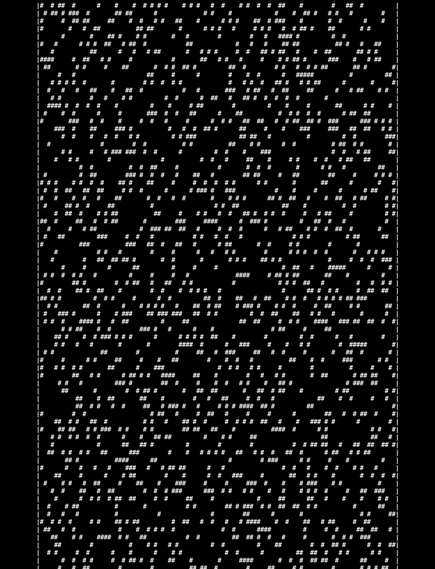

# Game of Life
> A program that simulates Conway's Game of Life

## Instructions:
1. Install all packages.
```js
npm install
```

2. Update configs at the beginning of `index.js`.
- `MAX_ITER`: maximum game iterations *(default = 50)*
- `GIF_INTERVAL`: interval of time between frames *(default = 20)*
- `OUTPUT_PATH`: path to output GIF file 

If you want to load your own board, set the following variable:
- `BOARD_PATH`: path to desired board.

Otherwise, leave it empty (`BOARD_PATH = ""`) in order to get a random board and set the following variables:
- `WIDTH`: board width *(default = 100)*
- `HEIGHT`: board height *(default = 100)*
- `THRESHOLD`: the approximate desired proportion of living to dead cells in the initial board *(default = 0.25)*

3. Run the script.
```js
npm start
```

### Loading personalized boards from file
The initial board state can be loaded from a file, which should be placed in the `boards` folder.

An example of file content is shown bellow (`toad.txt`):

```
000000
000000
001110
011100
000000
000000
```

## Testing
Some unit tests were implemented using the Jest library. To run the tests:
```js
npm test
```

## Game of Life Rules
1. Any live cell with 0 or 1 live neighbors becomes dead, because of underpopulation

2. Any live cell with 2 or 3 live neighbors stays alive, because its neighborhood is just right

3. Any live cell with more than 3 live neighbors becomes dead, because of overpopulation

4. Any dead cell with exactly 3 live neighbors becomes alive, by reproduction

## Example


## Credits
Inspired by: Robert Heaton's [Programming Projects For Advanced Beginners](https://robertheaton.com/2018/07/20/project-2-game-of-life/)